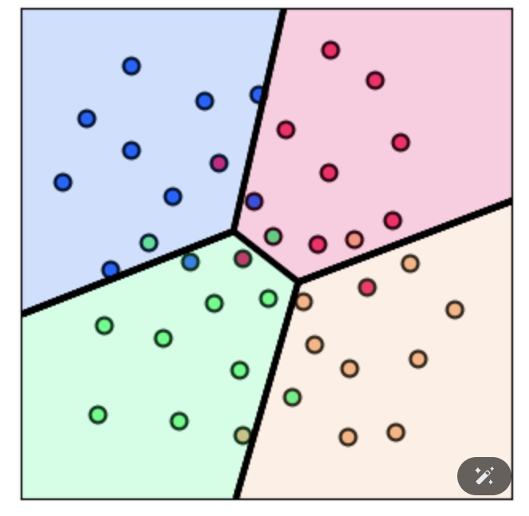

# 📊 Multiclass Softmax Classification

## 🔍 Overview
This project demonstrates **Multiclass Softmax Classification**, a widely used approach in **logistic regression** and **deep learning** to classify data into multiple categories. The Softmax function transforms raw scores into probabilities, making it ideal for classification tasks.

## 📌 Features
✅ Implements **Softmax Regression** for multi-class classification  
✅ Uses **cross-entropy loss** for optimization  
✅ Applies **gradient descent** to update parameters  
✅ **Visualizes decision boundaries** for better interpretation  

## 📂 Project Structure
- **Multiclass_Softmax.ipynb** → Jupyter Notebook with code & explanations
- **datasets/** → Sample datasets for training & testing
- **images/** → Visualization results

## 🛠 Installation & Setup
### 1️⃣ Clone the Repository
```bash
git clone https://github.com/arkistar4uu/Multiclass_Softmax_Classification.git
```
### 2️⃣ Navigate to the Project Directory
```bash
cd multiclass-softmax
```
### 3️⃣ Install Dependencies
Ensure you have Python 3.x installed. Then install required libraries:
```bash
pip install numpy pandas matplotlib autograd
```
### 4️⃣ Run the Notebook
Launch Jupyter Notebook and open `Multiclass_Softmax.ipynb`:
```bash
jupyter notebook
```

## 🚀 How It Works
1️⃣ **Define Model:** Implement the mathematical formulation of Softmax.  
2️⃣ **Compute Loss:** Use cross-entropy loss for optimization.  
3️⃣ **Gradient Descent:** Update parameters iteratively.  
4️⃣ **Visualization:** Plot decision boundaries to analyze model performance.  

## 📊 Example Results


## 🤝 Contributing
Want to improve this project? Feel free to fork the repo, make improvements, and submit a pull request! 🎉

## 📄 License
This project is licensed under the **MIT License**.

---

⭐ **If you find this project helpful, don't forget to star the repository!** ⭐

